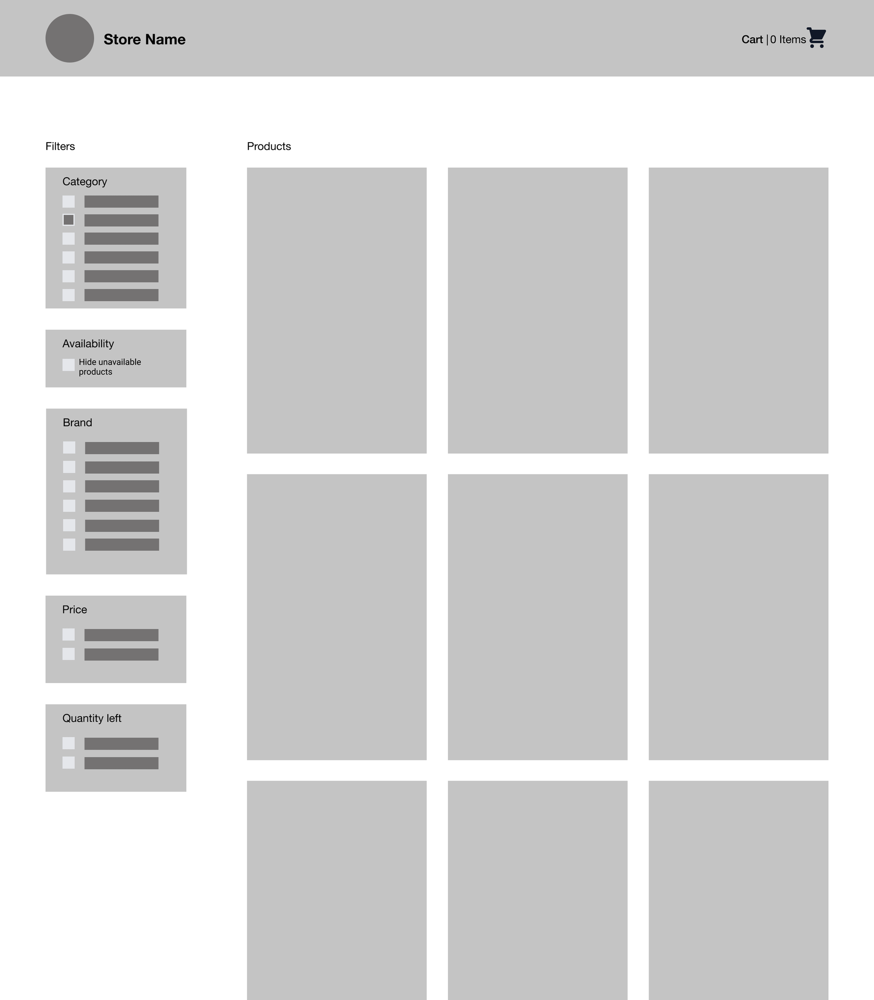
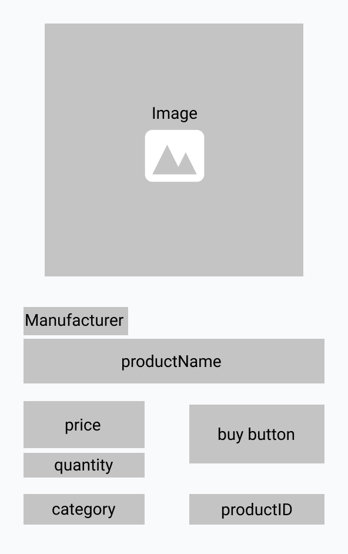

[](http://makeapullrequest.com)
[](http://www.firsttimersonly.com/)
[](https://gitpod.io/from-referrer/)

# 🛠 Storefront UI Project

This repo has the set up required to provide data to an application via an Express server. The project below details the what you could build. The idea here is that you can set up a frontend application project and consume the data provided here for the technology that you are learning.  

## 💡 Project Description

The best way to solidify your learning is by actually taking the skills and knowledge you just acquired and apply it to a project. This proves to yourself and others that you actually absorbed the knowledge that you came to learn.

Any skills that you thought you understood from a course/book/content become sharper and you'll understand them in a deeper way when you put them to practice.

In addition to proving to yourself that you know a topic, it's important that you demonstrate your skills to others (and potential employers!). This way when you apply for your next job in Web Development you don't have to convince everyone you know a skill, you can show them.

With this in mind, we have prepared a project challenge for you below. There are two aspects to the challenge: the technical bits and communicating your expertise so others know you truly get it.

## 📥 Project Brief

You work for a contracting business and have been paired up with a designer to build out a website for a hardware store.

The owner of the store needs to be more competitive with big hardware companies by making their online shopping experience as pleasant as possible.

Your task is to display hardware products for users to browse and purchase. You'll need to display all the products on a single page with key stats shown for each product. Additionally, the owner has requested that you be able to filter and sort these products.

You've been given the freedom to use what tech stack that you want. Your team has been building out products in Vue so that is what has been stubbed out for you with the data available to get started.

## 🗳 App Requirements

1. Display all products on a page
2. Product cards display key data
3. Product list can be filtered
4. Product list can be sorted
5. Clearly distinguish out of stock products

```prisma
model Product {
  id                Int     @id @default(autoincrement())
  name              String
  manufacturer      String?
  category          String
  image             String
  quantityInStock   Int
  price             Float
} 
```

## 📊 Development Standards

In addition to building out the application, it's written in your contract that you keep a development log and document the decisions that you make for the owner and future contractors.

Write a technical blog post(s) on the key takeaways that you have for implementing features in this application. Each App Requirement can make a great post.

## 📈 Stretch Goal

If implementing the app requirements above wasn't enough, take this application a step further by adding routing to individual product pages.

## 🪜 Steps To Get Started

[Spin this project up in Gitpod](https://gitpod.io/#https://github.com/zacjones93/Storefront-UI-Project) or follow the steps down below:

1. Fork this project
2. Run `yarn install`
3. Run `yarn setup`
4. Run `yarn server`
5. Install the framework of your choosing
6. Start implementing!

### ✅ Step 3. Prisma Output


### ✅ Step 4. Test Server

Send a request to the server to make sure you have a proper connection. I recommend installing the [VS Code Thunder Client](https://marketplace.visualstudio.com/items?itemName=rangav.vscode-thunder-client).

A successful request looks as follows:


## ⚡️ Using the Server REST API

The server will be running on `http://localhost:3000`. You can send API requests, e.g. `http://localhost:3000/products`

### GET

- `/products?searchString={searchSTring}&take={take}&skip={skip}`: Fetch all Products
  - Query Parameters
    - `searchString` (optional): This filters posts by `category` or `manufacturer`
    - `take` (optional): This specifies how many objects should be returned in the list
    - `skip` (optional): This specifies how many of the returned objects in the list should be skipped
- `/products/:id`: Fetch product by it's `id`

### POST

- todo

### PUT

- todo

### DELETE

- todo

## 🎨 Design

You've been paired up with a designer who has given you wire frames for your first iteration on the application. Reference them as you build out the application if you aren't sure how to make the page look.

The page layout has a header for the store information and shopping cart with filters for searching products on the left and product cards listed on the majority of the remaining screen.



The product card should display all of the data provided from the mock API that is being used.

A configuration like you see on the right works well but feel free to implement your own design if you’re up for the challenge.



## ✨ Credits

This project is an adaption of [Kevin Cunningham's vue-fundamentals-challenge](https://github.com/doingandlearning/vue-fundamentals-challenge).
